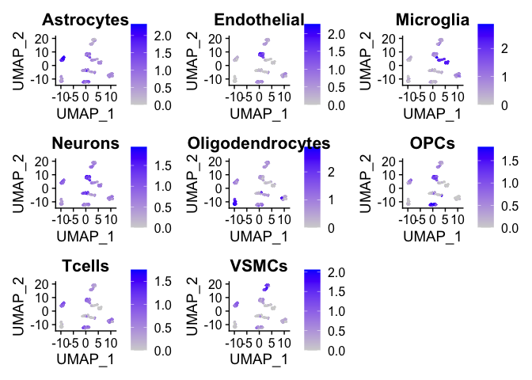

rfca
====

This package contains functions that trains a Random Forest Model with a
labelled Seurat Object, for predicting cell types/states in unlabelled
datasets. It also contains a pre-trained Random Forest model, as well as
example datasets.

Introduction
============

Manual cell annotation of scRNAseq datasets, typically based on marker
genes, can be time-consuming and biased. Being able to automatically
predict cell types/states in a cell-by-cell and cluster-unbiased way is
useful for fast and accurate phenotyping.

In addition, despite the increasing amounts of scRNAseq datasets being
generated, thorough analysis of these datasets is lagging, and/or done
in silos. This package comes with a preloaded Random Forest model based
on different datasets and cell types/states, that will be constantly
updated.

Installation
============

You can install this package from GitHub with
`devtools::install_github("kimberle9/rfca")`

Examples
========

Example 1: Creating a Seurat Object
-----------------------------------

``` r
# Load the rfca and Seurat libraries, as well as example datasets
library(rfca)
library(Seurat)
data("exampleSeuratObjectUnlabelled")
data("exampleSeuratObjectLabelled")

# Create Seurat Object with PCA and UMAP calculated
mySeuratObject <- createSeuratObjectPipeline(data.dir = "~/filtered_feature_bc_matrix", 
                                             nFeature_RNA_lower = 500, 
                                             nFeature_RNA_upper = 5000, 
                                             percent.mt = 5, 
                                             nfeatures = 2000, 
                                             dims = 20, 
                                             clusterResolution = 0.8)

# Assign cell type Idents to mySeuratObject manually, if you want to use it as a training dataset
```

Example 2: Using Random Forest to train and predict cell types
--------------------------------------------------------------

``` r
library(rfca)
library(Seurat)
data("exampleSeuratObjectUnlabelled")
data("exampleSeuratObjectLabelled")

# Create Random Forest Model with your labelled Seurat Object
myRandomForestModel <- createRFModel(exampleSeuratObjectLabelled)
```

    ## 
    ## Call:
    ##  randomForest(formula = V1 ~ ., data = merged, importance = TRUE,      proximity = TRUE) 
    ##                Type of random forest: classification
    ##                      Number of trees: 500
    ## No. of variables tried at each split: 13
    ## 
    ##         OOB estimate of  error rate: 4.7%
    ## Confusion matrix:
    ##                  Astrocytes Endothelial Microglia Neurons Oligodendrocytes OPCs
    ## Astrocytes               46           0         0       0                1    0
    ## Endothelial               0          52         2       0                0    0
    ## Microglia                 0           0        47       0                0    0
    ## Neurons                   1           0         0      46                1    3
    ## Oligodendrocytes          0           0         0       1               46    0
    ## OPCs                      0           0         1       1                1   47
    ## Tcells                    0           0         2       1                0    0
    ## VSMCs                     1           0         1       0                0    0
    ##                  Tcells VSMCs class.error
    ## Astrocytes            0     0  0.02127660
    ## Endothelial           0     0  0.03703704
    ## Microglia             0     0  0.00000000
    ## Neurons               1     0  0.11538462
    ## Oligodendrocytes      0     0  0.02127660
    ## OPCs                  1     0  0.07843137
    ## Tcells               49     0  0.05769231
    ## VSMCs                 0    52  0.03703704

``` r
# Create marker gene list from random forest model
markerGeneList <- createGeneLists(myRandomForestModel)
```

    ## [1] "Adding gene list for Astrocytes"
    ## [1] "Adding gene list for Endothelial"
    ## [1] "Adding gene list for Microglia"
    ## [1] "Adding gene list for Neurons"
    ## [1] "Adding gene list for Oligodendrocytes"
    ## [1] "Adding gene list for OPCs"
    ## [1] "Adding gene list for Tcells"
    ## [1] "Adding gene list for VSMCs"

``` r
# Visualize Feature Plot based on marker gene list
myPlot <- cellMarkerPlots(exampleSeuratObjectLabelled, geneList = markerGeneList)
```

    ## [1] "Calculating average expression of genes in Astrocytes list."
    ## [1] "Calculating average expression of genes in Endothelial list."
    ## [1] "Calculating average expression of genes in Microglia list."
    ## [1] "Calculating average expression of genes in Neurons list."
    ## [1] "Calculating average expression of genes in Oligodendrocytes list."
    ## [1] "Calculating average expression of genes in OPCs list."
    ## [1] "Calculating average expression of genes in Tcells list."
    ## [1] "Calculating average expression of genes in VSMCs list."

``` r
myPlot
```



``` r
# Predict cells based on your own Random Forest Model created above
autoLabelledSeuratObject <- predictCells(exampleSeuratObjectUnlabelled, myRandomForestModel)
```

    ## 
    ##       Astrocytes      Endothelial        Microglia          Neurons 
    ##               57               45               59               43 
    ## Oligodendrocytes             OPCs           Tcells            VSMCs 
    ##               54               48               48               42

``` r
# Predict cells based on my pre-loaded and pre-trained Random Forest Model
autoLabelledSeuratObject <- predictCells(exampleSeuratObjectUnlabelled)
```

    ## 
    ##       Astrocytes      Endothelial        Microglia          Neurons 
    ##               53               46               53               48 
    ## Oligodendrocytes             OPCs           Tcells            VSMCs 
    ##               53               49               48               46
