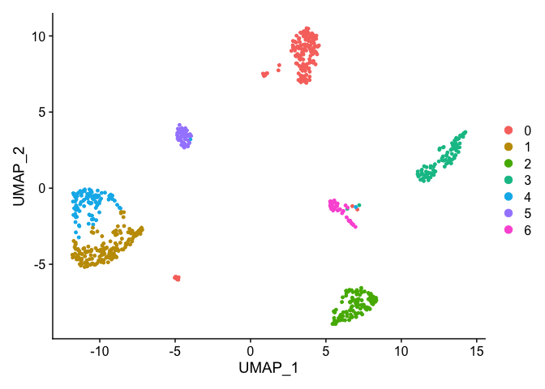

rfca
----

This package contains functions that trains a Random Forest Model with a
labelled Seurat Object, for predicting cell types/states in unlabelled
datasets. It also contains a pre-trained Random Forest model, as well as
example datasets.

Introduction
------------

Manual cell annotation of scRNAseq datasets, typically based on marker
genes, can be time-consuming and biased. Being able to automatically
predict cell types/states in a cell-by-cell and cluster-unbiased way is
useful for fast and accurate phenotyping.

In addition, despite the increasing amounts of scRNAseq datasets being
generated, thorough analyis of these datasets is lagging, and/or done in
silos. This package comes with a preloaded Random Forest model based on
different datasets and cell types/states, that will be constantly
updated.

Examples
--------

``` r
# Load the rfca and Seurat libraries
library(rfca)
library(Seurat)

# Create Seurat Object with PCA and UMAP calculated
mySeuratObject <- createSeuratObjectPipeline(data.dir = "~/filtered_feature_bc_matrix", nFeature_RNA_lower = 500, nFeature_RNA_upper = 5000, percent.mt = 5, nfeatures = 2000, dims = 20, clusterResolution = 0.8)
```

    ## Warning: Feature names cannot have underscores ('_'), replacing with dashes
    ## ('-')

    ## An object of class Seurat 
    ## 52636 features across 915 samples within 1 assay 
    ## Active assay: RNA (52636 features, 0 variable features)
    ## [1] "735 cells passed QC and are included"

    ## Centering and scaling data matrix

    ## PC_ 1 
    ## Positive:  Plp1, Aplp1, Cnp, Mog, Cldn11, Dbndd2, Mag, Mobp, Ermn, Tubb4a 
    ##     Tmem151a, Mbp, Cryab, Mal, Stmn4, Car2, Olig1, Mapt, Epb41l3, Gpr37 
    ##     Agpat4, Fez1, Slain1, Qdpr, Gpm6b, Fth1, Bin1, Sept4, Trf, Opalin 
    ## Negative:  Igfbp7, Id3, Tsc22d1, Klf2, Bsg, Flt1, Itm2a, Ifitm3, Ly6e, Ly6c1 
    ##     Cldn5, Pltp, Btg2, Ly6a, Hspb1, Egfl7, Klf4, Sparcl1, Id1, Sparc 
    ##     Slco1a4, Spock2, Pcp4l1, Cst3, Esam, Epas1, Ier2, Junb, Pecam1, H2-D1 
    ## PC_ 2 
    ## Positive:  Mt3, Clu, Fxyd1, Ttr, Chchd10, Gpm6a, Slc7a10, Ntm, Gm3764, Gpr37l1 
    ##     Ldhb, Atp1a2, Ntsr2, Igfbp2, Kcnk1, Sdc4, 1500015O10Rik, Dclk1, Aldoc, Bcan 
    ##     Gja1, Slc1a3, Atp1b2, Calml4, Id4, Slc1a2, Ntrk2, Gria2, Cxcl14, Ppp1r1b 
    ## Negative:  Cldn5, Flt1, Klf2, Ly6a, Ly6c1, Slc6a6, Ly6e, Klf4, Jun, Egfl7 
    ##     Itm2a, Spock2, Dusp1, Slco1a4, Fos, Slc9a3r2, Ier2, Nfkbia, Pecam1, Btg2 
    ##     Tsc22d1, Eng, Cxcl12, Apold1, Esam, Sgms1, Acvrl1, Foxq1, Tm4sf1, Junb 
    ## PC_ 3 
    ## Positive:  Rpl41, Atox1, Calml4, Atp5l, Sostdc1, Cab39l, Dstn, Cox6c, Pcp4l1, Cox7b 
    ##     Prdx5, 1500015O10Rik, Kl, Atp5g1, Atp5e, Clic6, Ndufa4, Uqcrq, Ndufv3, Enpp2 
    ##     Ttr, Uqcr11, Polr2l, Ndufa1, AC121965.1, Rbp1, Mcee, Tomm7, Usmg5, Uqcr10 
    ## Negative:  Cst3, Ntm, Gm3764, Gpr37l1, C1qa, C1qc, Csf1r, Slc1a3, Bcan, C1qb 
    ##     Plpp3, Trem2, Ntsr2, Ctss, Slc1a2, Selplg, Tmem119, Aldoc, Gja1, Hexb 
    ##     Fcer1g, Cxcl14, Fcrls, Gria2, Cx3cr1, Atp1a2, Olfml3, Cspg5, F3, Vsir 
    ## PC_ 4 
    ## Positive:  Sparcl1, Ntm, Gm3764, Gja1, Plpp3, Gpr37l1, Slc1a2, Ntsr2, Bcan, Htra1 
    ##     Slc1a3, Gria2, Atp1a2, Mt2, Ttyh1, Aldoc, Cspg5, Tril, Pla2g7, Cldn10 
    ##     Dclk1, F3, Mmd2, Atp1b2, Mfge8, Fgfr3, Slc7a10, Cxcl14, Vegfa, Sfxn5 
    ## Negative:  Csf1r, C1qc, Tmem119, Ctss, Selplg, Hexb, Trem2, C1qa, C1qb, Fcer1g 
    ##     Fcrls, Cx3cr1, Ly86, Gpr34, Olfml3, Unc93b1, Siglech, Lgmn, Laptm5, Slc15a3 
    ##     Tyrobp, Ctsd, Tnpo3, Pld4, Lag3, Ier5, Tgfbr1, Hk2, Cd37, P2ry12 
    ## PC_ 5 
    ## Positive:  Myl9, Rgs5, Ndufa4l2, Cald1, Higd1b, Nbl1, Notch3, Cox4i2, Vtn, Heyl 
    ##     Gper1, Mylk, Mustn1, Des, Gm13889, Tbx3os1, Rgs4, P2ry14, Ifitm1, Slc19a1 
    ##     Pdgfrb, Kcnj8, Rasl11a, Acta2, Gja4, Bgn, Foxs1, Tbx18, Tpm2, Tagln 
    ## Negative:  Slco1a4, Itm2a, Ly6a, Bsg, Cldn5, Flt1, Egfl7, Ly6e, Ly6c1, Klf2 
    ##     Slc2a1, Spock2, Pglyrp1, Tspan13, Slc7a5, Foxq1, Kank3, Pltp, Ablim1, Id1 
    ##     Ramp2, Slco1c1, Vwa1, Slc6a6, Pecam1, Abcb1a, Ctla2a, Cd34, Abcg2, Mecom

    ## Computing nearest neighbor graph

    ## Computing SNN

    ## Modularity Optimizer version 1.3.0 by Ludo Waltman and Nees Jan van Eck
    ## 
    ## Number of nodes: 735
    ## Number of edges: 22105
    ## 
    ## Running Louvain algorithm...
    ## Maximum modularity in 10 random starts: 0.8573
    ## Number of communities: 7
    ## Elapsed time: 0 seconds

    ## Warning: The default method for RunUMAP has changed from calling Python UMAP via reticulate to the R-native UWOT using the cosine metric
    ## To use Python UMAP via reticulate, set umap.method to 'umap-learn' and metric to 'correlation'
    ## This message will be shown once per session

    ## 16:10:57 UMAP embedding parameters a = 0.9922 b = 1.112

    ## 16:10:57 Read 735 rows and found 20 numeric columns

    ## 16:10:57 Using Annoy for neighbor search, n_neighbors = 30

    ## 16:10:57 Building Annoy index with metric = cosine, n_trees = 50

    ## 0%   10   20   30   40   50   60   70   80   90   100%

    ## [----|----|----|----|----|----|----|----|----|----|

    ## **************************************************|
    ## 16:10:57 Writing NN index file to temp file /var/folders/22/7my2dpks7cqftfz3r43530q40000gp/T//Rtmp6hqIiY/file12fbb45343
    ## 16:10:57 Searching Annoy index using 1 thread, search_k = 3000
    ## 16:10:57 Annoy recall = 100%
    ## 16:10:57 Commencing smooth kNN distance calibration using 1 thread
    ## 16:10:58 Initializing from normalized Laplacian + noise
    ## 16:10:58 Commencing optimization for 500 epochs, with 27536 positive edges
    ## 16:10:59 Optimization finished

    ## 
    ##   0   1   2   3   4   5   6 
    ## 167 161 114 100  97  54  42

``` r
# Assign cell type/state Idents to mySeuratObject manually, if you want to use it as a training dataset

# Visualize Seurat Object with a UMAP plot
DimPlot(mySeuratObject)
```




``` r
# Create Random Forest Model with your labelled Seurat Object
data("exampleSeuratObjectLabelled")
myRandomForestModel <- createRFModel(exampleSeuratObjectLabelled)
```

    ## 
    ## Call:
    ##  randomForest(formula = V1 ~ ., data = merged, importance = TRUE,      proximity = TRUE) 
    ##                Type of random forest: classification
    ##                      Number of trees: 500
    ## No. of variables tried at each split: 13
    ## 
    ##         OOB estimate of  error rate: 4.46%
    ## Confusion matrix:
    ##                  Astrocytes Endothelial Microglia Neurons Oligodendrocytes OPCs
    ## Astrocytes               46           0         0       0                1    0
    ## Endothelial               0          52         2       0                0    0
    ## Microglia                 0           0        47       0                0    0
    ## Neurons                   1           0         0      46                1    3
    ## Oligodendrocytes          0           0         0       1               46    0
    ## OPCs                      0           0         1       1                1   47
    ## Tcells                    0           0         2       0                0    0
    ## VSMCs                     1           0         1       0                0    0
    ##                  Tcells VSMCs class.error
    ## Astrocytes            0     0  0.02127660
    ## Endothelial           0     0  0.03703704
    ## Microglia             0     0  0.00000000
    ## Neurons               1     0  0.11538462
    ## Oligodendrocytes      0     0  0.02127660
    ## OPCs                  1     0  0.07843137
    ## Tcells               50     0  0.03846154
    ## VSMCs                 0    52  0.03703704

``` r
# Create marker gene list from random forest model
markerGeneList <- createGeneLists(myRandomForestModel)
```

    ## [1] "Adding gene list for Astrocytes"
    ## [1] "Adding gene list for Endothelial"
    ## [1] "Adding gene list for Microglia"
    ## [1] "Adding gene list for Neurons"
    ## [1] "Adding gene list for Oligodendrocytes"
    ## [1] "Adding gene list for OPCs"
    ## [1] "Adding gene list for Tcells"
    ## [1] "Adding gene list for VSMCs"

``` r
# Visualize Feature Plot based on marker gene list
myPlot <- cellMarkerPlots(exampleSeuratObjectLabelled, geneList = markerGeneList)
```

    ## [1] "Calculating average expression of genes in Astrocytes list."
    ## [1] "Calculating average expression of genes in Endothelial list."
    ## [1] "Calculating average expression of genes in Microglia list."
    ## [1] "Calculating average expression of genes in Neurons list."
    ## [1] "Calculating average expression of genes in Oligodendrocytes list."
    ## [1] "Calculating average expression of genes in OPCs list."
    ## [1] "Calculating average expression of genes in Tcells list."
    ## [1] "Calculating average expression of genes in VSMCs list."

``` r
# Predict cells based on your own created Random Forest Model created above
data("exampleSeuratObjectUnlabelled")
automaticallyLabelledSeuratObject <- predictCells(exampleSeuratObjectUnlabelled, myRandomForestModel)
```

    ## 
    ##       Astrocytes      Endothelial        Microglia          Neurons 
    ##               55               45               59               43 
    ## Oligodendrocytes             OPCs           Tcells            VSMCs 
    ##               55               49               48               42

Installation
------------

You can install this package from GitHub with
`devtools::install_github("kimberle9/rfca")`
